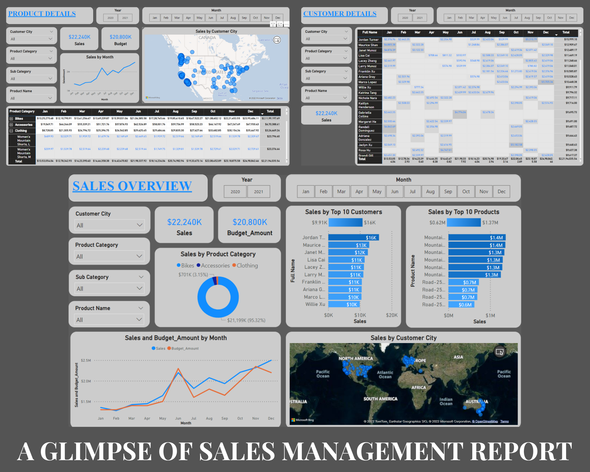
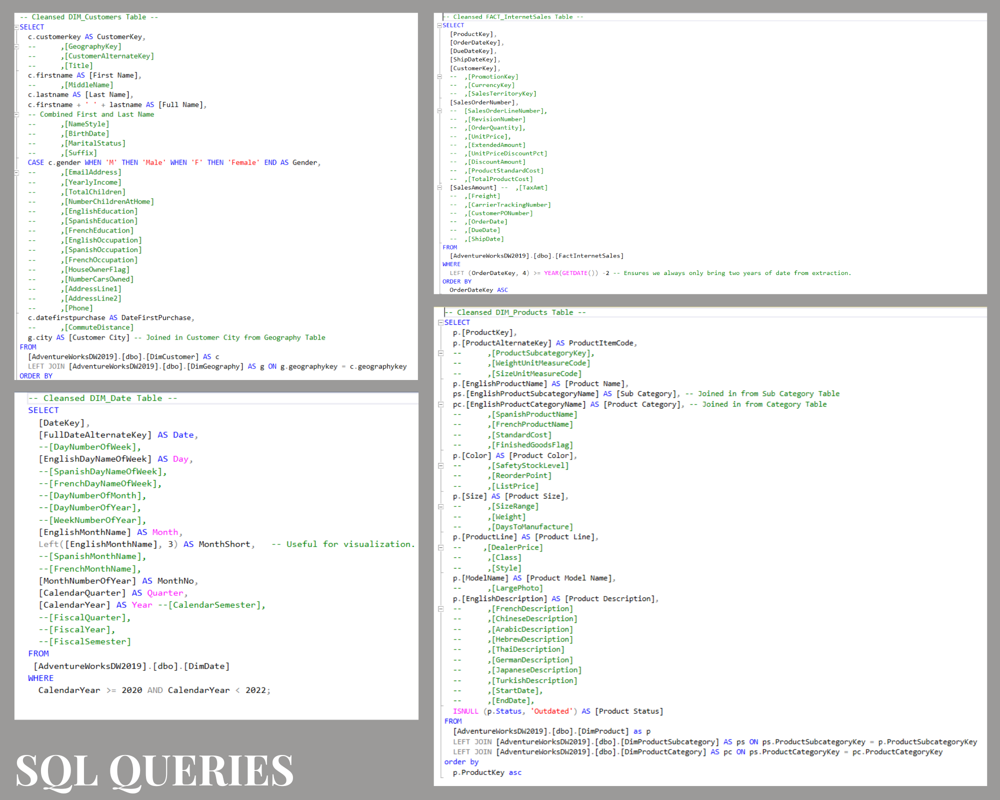
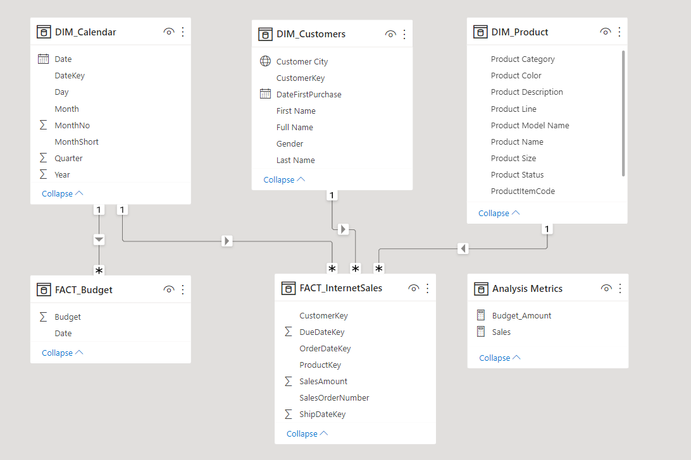

# **PowerBI and SQL for SALES MGMT**

This project involved creating an executive sales report for sales managers, leveraging Power BI and SQL. The aim was to provide insightful dashboards tailored to the needs of sales managers and representatives. Below is a breakdown of the business request and user stories that guided the project's development, ensuring that acceptance criteria were met.

## **Business Request and User Stories**
The project stemmed from a request for an executive sales report. Based on this, user stories were outlined to deliver value and align with business goals.
| **No.** | **As a (role)** | **I want (request / demand)** | **So that I (user value)** | **Acceptance Criteria** |
| :--- | :----------- | :-------- | :------- | :------------------------- |
| 1   | Sales Manager | A dashboard overview of sales in year 2020 and 2021 | Identify top customers and products | A Power BI dashboard displaying the top 10 products and customers with filtering options. |
| 2   | Sales Manager | A dashboard comparing sales and budget | Track sales performance against budget | A Power BI dashboard with graphs comparing sales over time to budget data |
| 3   | Sales Representative | A detailed view of Sales per Customer | Monitor high-value customers and identify opportunities | A Power BI dashboard with filters to analyze sales for each customer |
| 4   | Sales Representative | A detailed view of Sales per Product | Track top-performing products | A Power BI dashboard with filters to analyze sales for each Product |

## **Data Cleansing & Transformation (SQL)**

To build the necessary data model for analysis and reporting, data was extracted and transformed using SQL. This included cleansing and preparing the data for integration into Power BI.

The following tables were extracted and processed:

  1. [_DIM_Calendar.sql_](SQL_Queries/DIM_Calendar.sql)
  2. [_DIM_Customers.sql_](SQL_Queries/DIM_Customers.sql)
  3. [_DIM_Product.sql_](SQL_Queries/DIM_Product.sql)
  4. [_FACT_InternetSales.sql_](SQL_Queries/FACT_InternetSales.sql)

Additionally, a supplementary data source, FACT_SentSalesBudget, was provided in Excel format and integrated into the data model later in the process.

## **Data Model**

After cleansing and preparing the data, it was imported into Power BI, and a data model was created. The model connects FACT_InternetSales and FACT_Budget with key dimension tables such as DIM_Calendar, DIM_Customers, and DIM_Product to enable comprehensive analysis and reporting.

## **Sales Management Dashboard**

The completed dashboard offers:

Sales Overview: A high-level view of sales performance and budget comparison.
Customer Details: Insights into customer-specific sales performance.
Product Details: Analysis of product-specific sales trends.
The dashboard allows filtering and interaction to cater to the diverse needs of sales managers and representatives.

## **Final Report**

The finalized report file, Sales_Report_Final.pbix, can be accessed for further exploration in Power BI Desktop. Below are screenshots showcasing the report's capabilities:

Sales Overview Dashboard: Highlights sales trends and budget comparisons.
Customer Details View: Offers a deep dive into customer-specific sales data.
Product Details View: Provides insights into product-specific performance.

### _**Thank you for reviewing this project!**_
